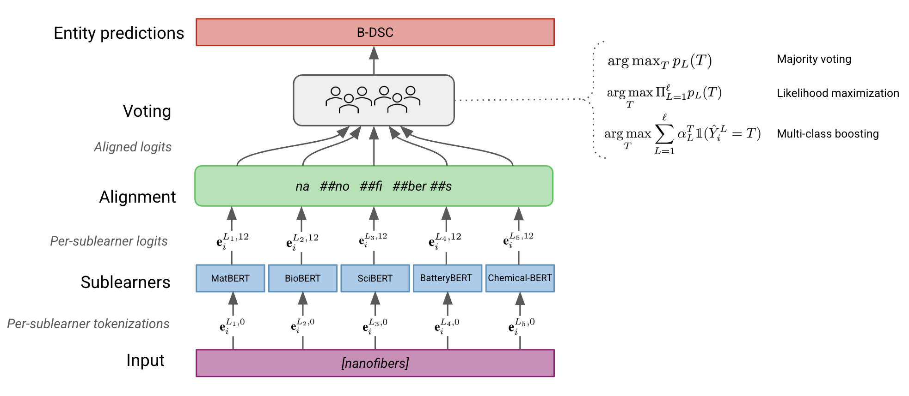

# ⚛️ BondBERT: An ensemble model for materials science NLP
*Bringing learners together like atomic bonds...*


## About
Materials science – the study of the physical, chemical, and biological properties of materials to inform engineering design – produces large volumes of experimental data, 
that, due to poor data centralization historically, are scattered across publications in academic journals. Named entity recognition (NER) to extract entity references in
past research studies, such as chemical names, crystal structures, or experimental conditions, is therefore a key task to leverage big data for informatics work in the field. 
However, traditional NER frameworks have performed poorly when applied to the material science domain: because materials science is an inherently interdisciplinary field, 
writing in academic literature displays diverse syntactic patterns from related areas such as chemistry, physics, and biology. 

**BondBERT** addresses this problem by *embracing* the interdisciplinary nature of materials literature. This package implements **ensemble** methods to tackle NER tasks
by leveraging a group of BERT-based learners each specializing in a specific domain. In doing so, it achieves **specificity** by way of pre-training each learner on a corpus with narrow focus and **diversity** through metalearner architectures that facilitate transfer learning across these ensembled subdomain ”experts".

 At inference time, each learner of the ensemble independently tokenizes the input text and generates entity predictions. An alignment algorithm is applied to align tokenizations across learners in the ensemble and ensure cross-correspondence in 
the subword partitions used for entity assignment. The ensemble metalearner then outputs a final prediction for the entity label of each token in the dataset by way of one of three voting methods:
* Majority voting: a "winner takes all" approach in which each learner of the ensemble casts a vote for the most probable entity label
* Likelihood maximization: a probabilistic approach that selects an entity label prediction by maximizing the joint density of predicted softmax probabilities across the ensemble
* Boosting: a variant of multiclass Adaboost that weights each learner's vote by its confidence in making predictions for the corresponding entity class 


<p align="center">
  
</p>

See the BondBERT [manuscript](https://drive.google.com/file/d/1p6CevjP6UgZsCMUQCNxDrNikqmD4AtqX/view?usp=sharing) for a full description of the theory and algorithmic implementation of the ensemble scheme.

While proof-of-concept model development and validation was performed on a materials science-specific NER corpus, the functionality implemented in this package can be extended to create an ensemble for any group of learners of interest. 

## Installation
Clone the repo
```
git clone https://github.com/b-crouch/bondbert
```

Install prerequisites
```
pip install -r requirements.txt
```

Install `bondbert`
```
pip install -e .
```

## Usage
Load the [Matscholar](https://matscholar.com/) example corpus 
```
import bondbert
from datasets import load_dataset

dataset = load_dataset("json", data_files="datasets/processed/matscholar_processed_full.json")
id2label = bondbert.data.load_id2label("datasets/processed/matscholar_id2label.pkl")
```

Create and train a boosting ensemble with [SciBERT](https://huggingface.co/allenai/scibert_scivocab_cased) (pretrained on general scientific literature), [BioBERT](https://huggingface.co/dmis-lab/biobert-v1.1) (pretrained on biomedical literature), and [BatteryBERT](https://huggingface.co/batterydata/batterybert-cased) (pretrained on battery physics) sublearners
```
learners = ["allenai/scibert_scivocab_cased", "dmis-lab/biobert-base-cased-v1.2", "batterydata/batterybert-cased"]

ensemble = bondbert.ensemble.BoostingEnsemble(learners, id2label)
ensemble.train(dataset, batch_size=32)
```

Generate entity label predictions
```
ensemble.predict(dataset, batch_size=32)
```

See the `examples` directory for more usage examples
